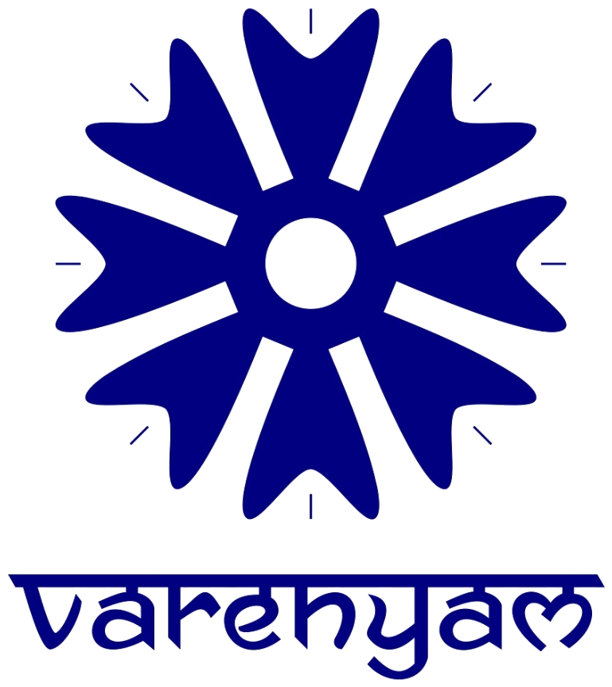

<p align="center">
	<picture>
		<source srcset="public/assets/images/logo-white.png" media="(prefers-color-scheme: dark)">
		
	</picture>
</p>

This is a Next.js frontend project (TypeScript) containing a small marketing site with sections for products, industries, about, and contact.

Status
- Initial scaffolded site — components, pages, and basic styling included.

Key features
- Next.js app structure with app directory and TypeScript
- Reusable React components in `src/components`
- Site sections in `src/sections` and page routes in `src/app`
- Static assets in `public/assets/images`

Quick start

1. Install dependencies

```powershell
npm install
```

2. Run development server

```powershell
npm run dev
```

3. Open the app

Visit http://localhost:3000 in your browser.

Project structure (high level)

- `src/app` — Next.js app routes and pages
- `src/components` — UI components (Navbar, Footer, FloatingWhatsApp)
- `src/sections` — Page sections (Hero, About, Products, Industries, Contact)
- `src/data` — Static data used by the site
- `public` — Static assets

What you can change
- Update copy and images in `src/app` and `public`.
- Add or adjust components in `src/components`.
- Customize styles in `src/app/globals.css`.

Contributing
- Feel free to open issues or submit PRs. For now, coordinate changes via this repository and I'll review.

License
- Add a license of your choice.

Contact
- If you want help updating the README content, tell me what to include and I'll update it.
This is a [Next.js](https://nextjs.org) project bootstrapped with [`create-next-app`](https://nextjs.org/docs/app/api-reference/cli/create-next-app).

## Getting Started

First, run the development server:

```bash
npm run dev
# or
yarn dev
# or
pnpm dev
# or
bun dev
```

Open [http://localhost:3000](http://localhost:3000) with your browser to see the result.

You can start editing the page by modifying `app/page.tsx`. The page auto-updates as you edit the file.

This project uses [`next/font`](https://nextjs.org/docs/app/building-your-application/optimizing/fonts) to automatically optimize and load [Geist](https://vercel.com/font), a new font family for Vercel.

## Learn More

To learn more about Next.js, take a look at the following resources:

- [Next.js Documentation](https://nextjs.org/docs) - learn about Next.js features and API.
- [Learn Next.js](https://nextjs.org/learn) - an interactive Next.js tutorial.

You can check out [the Next.js GitHub repository](https://github.com/vercel/next.js) - your feedback and contributions are welcome!

## Deploy on Vercel

The easiest way to deploy your Next.js app is to use the [Vercel Platform](https://vercel.com/new?utm_medium=default-template&filter=next.js&utm_source=create-next-app&utm_campaign=create-next-app-readme) from the creators of Next.js.

Check out our [Next.js deployment documentation](https://nextjs.org/docs/app/building-your-application/deploying) for more details.
